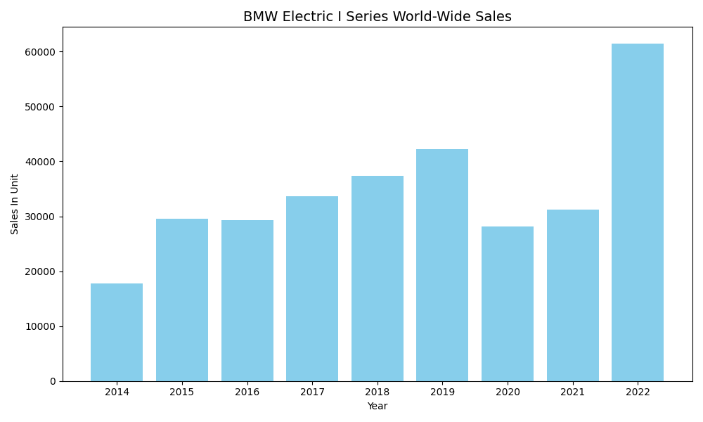
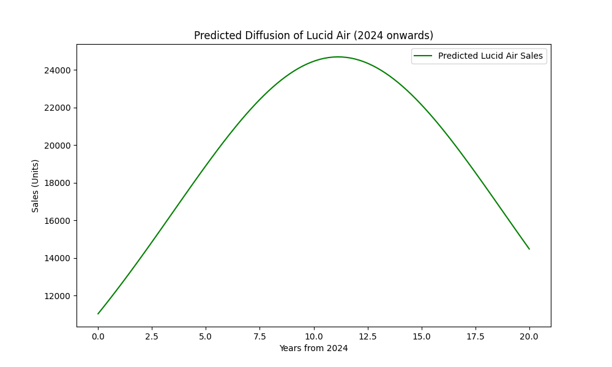
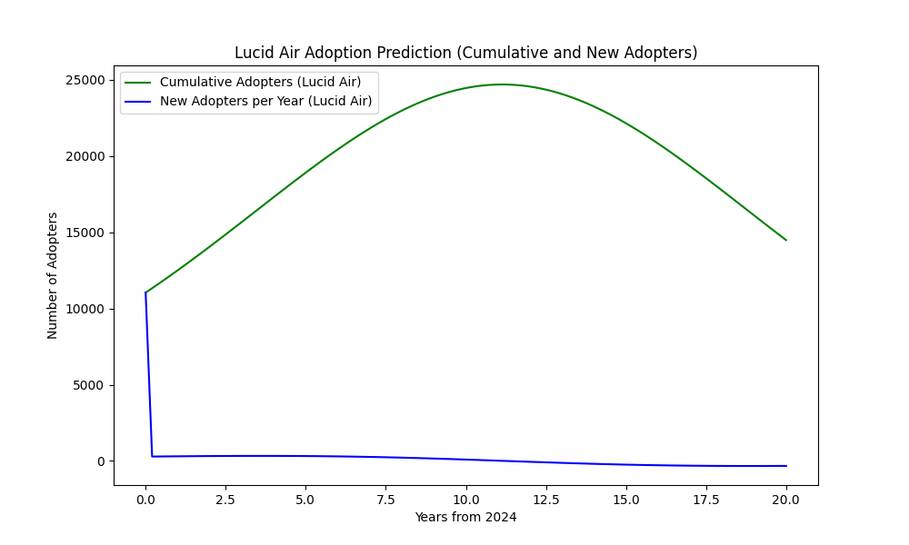

# Bass Model Analysis for Lucid Air

**Elvina Nosrati**  
**10/18/2024**

From **TIME’s Best Inventions of 2022**, this paper will focus on the **Lucid Air**, a luxury electric vehicle, its look-alike innovation from the past, an estimated Bass Model, diffusion predictions, and the number of worldwide adopters expected for this product.

The **Lucid Air** stands out in the competitive electric vehicle market due to its combination of performance, luxury, and advanced technology. Offering an unparalleled range of over 500 miles per charge, the **Lucid Air** delivers both power and efficiency. With a sleek design and features aimed at redefining luxury, the **Lucid Air** is poised to capture the attention of environmentally conscious consumers who still value high performance. (TIME, 2022)

Lucid Motors emphasizes sustainability and cutting-edge innovation in the EV space, similar to high-end competitors. The vehicle’s advanced battery technology and fast-charging capabilities have made it a serious competitor to other luxury EV brands, but at a higher level of craftsmanship and interior quality. (TIME, 2022)

### Look-Alike Innovation: BMW i Series

For a past innovation, the **BMW i series** was selected as a comparison. The BMW i electric series, which includes models such as the BMW i3 and BMW i8, has been a major player in the electric vehicle market for several years. Like the Lucid Air, BMW’s i series represents a strong push toward sustainable transportation, offering electric powertrains that combine performance and eco-friendliness. Both brands are known for their focus on luxury, innovation, and driving experience, making BMW an ideal look-alike product for comparison.

The **BMW i series data** used in this report comes from Statista, representing global sales from 2014 to 2018. This historical data will help estimate the Bass Model parameters for the Lucid Air and predict its future market adoption.

### BMW Electric I Series World-Wide Sales

The following plot shows the global sales data for the **BMW i series** from 2014 to 2022.

  
*Figure 1: BMW Electric I Series sales over time (2014-2022).*

As we can see, **BMW Electric I Series** sales have shown strong growth over the years, with some fluctuation during 2020–2021, possibly due to the impact of the COVID-19 pandemic.

---

### Bass Model Parameter Estimation

Based on the historical sales data of the **BMW i series**, the estimated parameters for the **Bass diffusion model** are:

- **Coefficient of Innovation (p)**: 0.0221
- **Coefficient of Imitation (q)**: 0.1501
- **Market Potential (M)**: 1,000,000 units

These parameters suggest that the **Lucid Air** will follow a similar adoption pattern, with early innovation playing a moderate role and social imitation driving growth over time.

---

### Lucid Air Predicted Sales

Using the **Bass Model**, we predicted the diffusion curve for the **Lucid Air** based on the estimated parameters. The prediction shows steady growth in adoption over the next 20 years, with a potential market size of 500,000 units.

  
*Figure 2: Predicted diffusion curve for Lucid Air over the next 20 years.*

The **Lucid Air** is expected to reach its market potential over two decades, following a trajectory driven by both innovation and social influence.

---

### Estimated Number of Adopters Over Time

The following plot illustrates the **cumulative adopters** and **new adopters** of the **Lucid Air** based on the Bass Model prediction. The number of new adopters peaks around the middle of the period, while the cumulative adopters steadily increase until the market reaches saturation.

  
*Figure 3: Cumulative and new adopters of Lucid Air over the next 20 years.*

The **Bass Model** predicts that the number of new adopters will decline after the peak, as the market becomes saturated, while the total number of adopters continues to approach the market potential.

---

### Scope of Analysis: United States

This analysis focuses on the **United States** as the primary market for the **Lucid Air**. Lucid Motors is a U.S.-based company, and the U.S. electric vehicle market is one of the fastest-growing in the world. In particular, states like **California** are leaders in EV adoption, providing tax credits and incentives that make EVs more accessible to consumers.

The U.S. government has recently introduced additional incentives for electric vehicles, such as the **Inflation Reduction Act of 2022**, which is expected to drive EV adoption across the country.

---

### Conclusion

In this report, we applied the **Bass Model** to estimate the future diffusion of the **Lucid Air** based on historical data from the **BMW i series**. The estimated parameters—**coefficient of innovation (p)**, **coefficient of imitation (q)**, and **market potential (M)**—provided insights into the potential market adoption of the Lucid Air.

**Key insights** include:
- **Steady adoption growth** driven by innovation and social influence.
- **New adopters** peaking mid-way through the 20-year period, followed by a decline as the market saturates.
- A potential market size of **500,000 units** for the **Lucid Air** in the United States.

While the model shows strong predictive power, real-world factors such as **economic conditions**, **technological advancements**, and **competition** could affect the actual adoption rate of the Lucid Air.

### References

- TIME. (2022). Lucid Air: A luxury electric vehicle. TIME Best Inventions of 2022. Retrieved from [https://time.com/collection/best-inventions-2022/6228204/lucid-air/](https://time.com/collection/best-inventions-2022/6228204/lucid-air/)

- Statista. (n.d.). Global sales of BMW i electric vehicles from 2014 to 2018. Statista. Retrieved from [https://www.statista.com/statistics/417011/global-sales-of-bmw-i-electric-vehicles/](https://www.statista.com/statistics/417011/global-sales-of-bmw-i-electric-vehicles/)